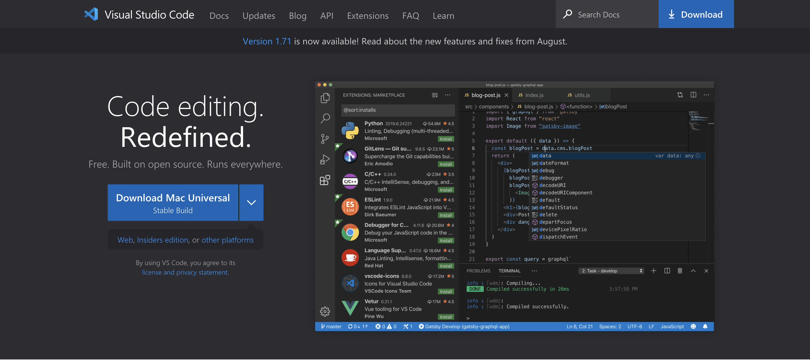
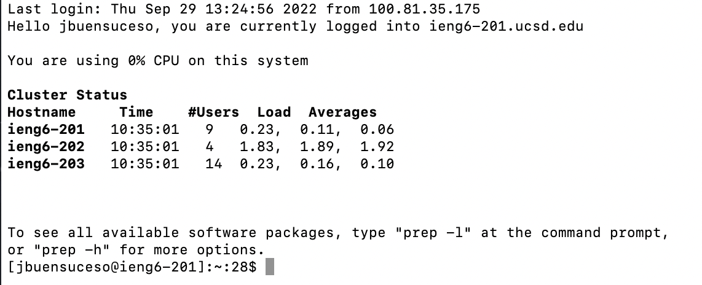
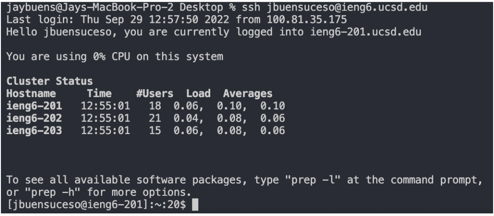

# Week 1 Lab Report
Within CSE 15L we are required to install vscode and remote into ieng6. These are a summary of how to set up remote connection and various commands to make the connection easier to use. 

This tutorial makes the assumption that you are using an OSX operating system, meaning that SSH is already available to you out of the box.

[Install VS Code](#vscode)

[Remote Connection](#remote)

[Trying Some Commands](#commands)

[Moving Files With scp](#scp)

[Setting SSH Key](#ssh)

[Concluding Statement](#conclusion)

### <a name="vscode">
# Installing VS Code

The IDE used for this setup is Microsoft's Visual Studio Code. The download link can be found here:

[Download Visual Studio Code](https://code.visualstudio.com/)

Follow the steps until VS code is properly installed on your system.

### <a name="remote">
# Remote Connection

In order to connect to ieng6 remote servers, prerequisite steps have to be fulfilled.

- Make sure ieng6 account is properly updated with a password.
- if it is not updated log into this website to [change password](https://sdacs.ucsd.edu/~icc/index.php)

Once the passwords have been set up, open VScode and create a new terminal.

 - To log into your account first type in `ssh` then your account@ieng6.ucsd.edu, in my case it is `ssh cs15lfa22hs@ieng6.ucsd.edu`
 -  It will now prompt you for a password. Enter your password.

 - In the chance that this does not work, use your regular username as the username e.g. `ssh jbuensuceso@ieng6.ucsd.edu` and use your AD password.

 After successful login, your terminal should look like this:

Congratulations you are now sucessfully connected to the ieng6 server.

### <a name="commands">
# Trying Some Commands

Once connected to the terminal, try using the `ls` command.

As you can see, it shows the contents of the current directory.

Another command is: `cat /home/linux/ieng6/cs15lfa22/public/hello.txt`

This command concatenates the file, in this case, `hello.txt` and prints out the contents

### <a name="scp">
# Moving Files With scp

The `scp` command allows for files to be transferred to the local desktop and into the remote desktop.

In this screenshot we move WhereAmI.java from my local directory into the remote directory. In order to do this do `scp fileName remoteDirectoryLogin`. After this, it will prompt a password then the file name will print once transfer is successful.

In order to view the file, `ssh` into the remote server once again and do the `javac` command to compile the file and `java` to run the file.

### <a name="ssh">
# Setting SSH Key

In order to make the process faster, you can set an SSH key between your client and the server. It does this by sending a public key to the server while the client retains a private key.

- On the client do the command `ssh-keygen` and use empty passphrases.
- It should save onto the directory /users/userName/.ssh/
-ssh into the ieng6 server once again and use the command `mkdir.ssh` to make an ssh directory. Log out.
- On the local client `scp` the public key using the command `scp /Users/userName/.ssh/id_rsa.pub username@ieng6.ucsd.edu:~/.ssh/authorized_keys`
- Upon completion, you will no logner need to input the password when connecting between this client computer and the server.

The screenshot below shows what the terminal would look like when logging into the server using an authorized client with ssh keys. Notice that I no longer have to type in my password.

### <a name="optimizing">
# Optimizing Remote Running

The beauty of terminal is that every command is saved meaning that you only have to use the `up arrow` to view previous commands. 

By setting up the SSH key and having all my prior commands saved, I am able to udate the `WhereAmI.java` file in 10 keystrokes.

The process I underwent is:
- update the java file
- up arrow to scp the java file into remote server (2)
- up arrow to ssh into remote server (2)
- up arrow to javac the java file (3)
- up arrow to java command  (3)

### <a name="conclusion">
# Concluding Statement

This report outlines how one would ssh into the ieng6 server and set up an ssh key between their client and the server.

