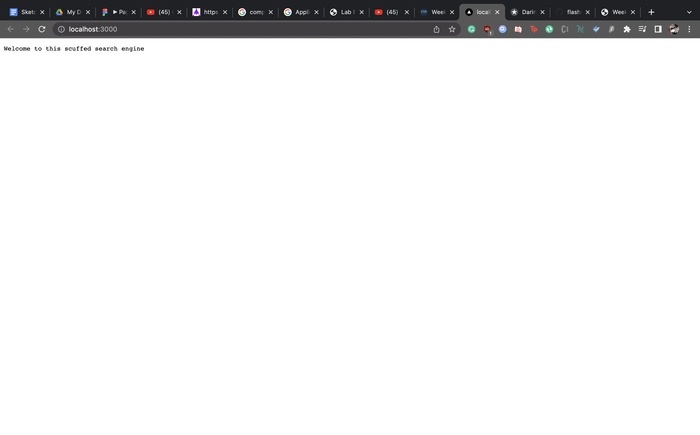
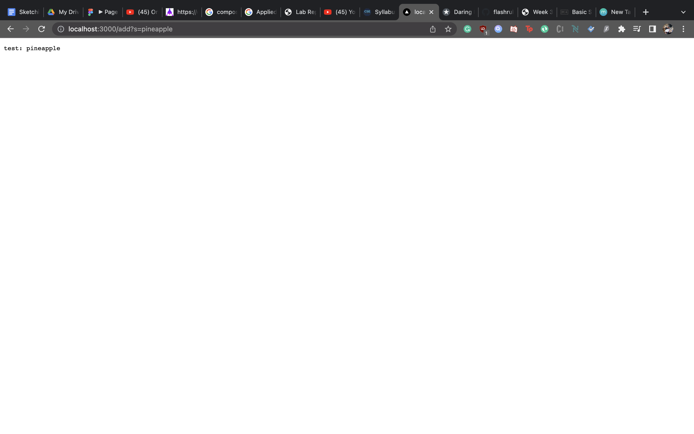
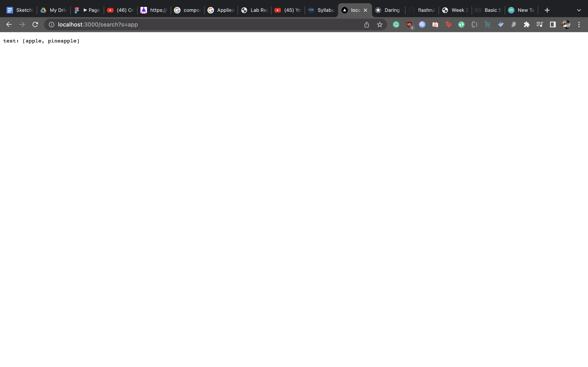
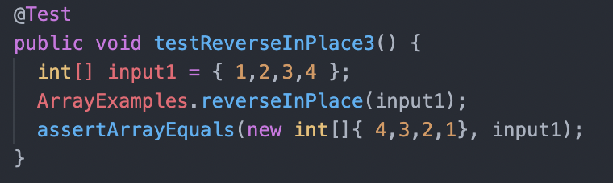
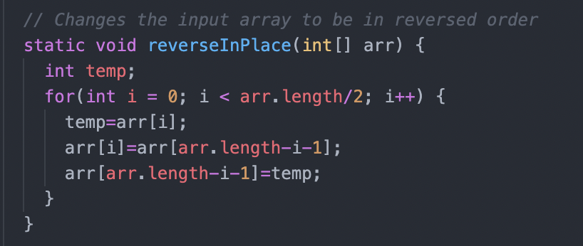

# Week 3 Lab Report

# Simplest Search Engine

    import java.io.IOException;
    import java.net.URI;
    import java.util.*;

    class Handler implements URLHandler {
        int num = 0;
        ArrayList<String> queries = new ArrayList<String>();
        
        public String handleRequest(URI url) {
            if (url.getPath().equals("/")) {
                return String.format("Welcome to this scuffed search engine");
            } else if (url.getPath().equals("/add")) {
                String[] parameters = url.getQuery().split("=");
                if (parameters[0].equals("s")) { 
                    queries.add(parameters[1]);
                    return String.format("test: " + queries.get(queries.size()-1));
                }
                return String.format("else try again");
            } else {
                System.out.println("Path: " + url.getPath());
                if (url.getPath().contains("/search")) {
                    String[] parameters = url.getQuery().split("=");
                if (parameters[0].equals("s")) { 
                    String query = parameters[1];
                    ArrayList<String> values = new ArrayList<String>();
                    for(int x=0;x<queries.size();x++){
                        if(queries.get(x).contains(query)){
                            values.add(queries.get(x));
                        }
                    }
                    return String.format("test: " + values.toString());
                }
                }

                return "404 Not Found!";
            }
        }
    }

    public class SearchEngine {
        public static void main(String[] args) throws IOException {
            if(args.length == 0){
                System.out.println("Missing port number! Try any number between 1024 to 49151");
                return;
            }

            int port = Integer.parseInt(args[0]);

            Server.start(port, new Handler());
        }
    }

## Homepage

The homepage calls the `handleRequest` method which displays the landing text.
## adding apple

For the add functionality it goes into `handleRequest` and jumps the the elseif statement. it splits the query at the = sign and takes the last element as the added word. 

The queries arraylist handles all the added words and the word from the add query is added into the arraylist using the `add` method.
## adding pineapple

Similarly, for the add functionality it goes into `handleRequest` and jumps the the elseif statement. it splits the query at the = sign and takes the last element as the added word. 

The queries arraylist handles all the added words and the word from the add query is added into the arraylist using the `add` method.

## Searching

the search functionality of the simple search engine utilizes else statement in the `handleRequest` method. it splits the url by the = sign and puts it in an array. Then checks the last index of the array and uses a for loop to compare the query with the ArrayList containing all the added variables. if those words contain the query, i.e. apple containing the string app. then it is added to a new arraylist and that arraylist is returned by the search engine.

# Finding Bugs

The failure inducing input for reverseInPlace is:

which led to an assertion error.

The bug is that the loop is not doing the swap properly and it is losing half of the list in the loop. The fix I did for this was creating a temporary variable and using that as an intermediary when doing the reverse swap.

Fixed Code:

I unfortunately did not have time to finish the other set of errors as I was busy trying to troubleshoot the first array errors.

