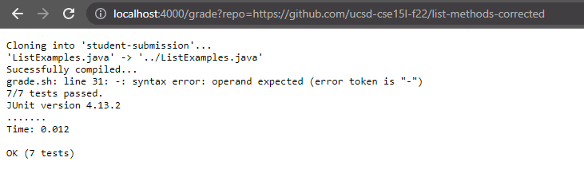

# Week 8/9 Lab Report 5

## Grade.sh Code Block
    # Create your grading script here
    PTH=".;lib/hamcrest-core-1.3.jar;lib/junit-4.13.2.jar"
    rm -rf student-submission
    git clone $1 student-submission
    cd student-submission
    if test -f ListExamples.java
    then
        cp -v ListExamples.java ../
    else 
        echo "incorrect file, please use the correct naming/formatting"
        exit 1
    fi
    cd .. 
    javac -cp $PTH *.java 2> compile_error.txt

    if [[ $? -ne 0 ]]
    then
        echo "Failed to compile."
        cat compile_error.txt
        exit 1
    else
        echo "Sucessfully compiled..."
    fi

    java -cp $PTH org.junit.runner.JUnitCore TestListExamples > Result.txt
    grep "Tests run:" < Result.txt > ResultScore.txt
    VARS=(`grep -Eo '[0-9]{1,2}' < resultScore.txt`)
    TOTAL_TESTS=${VARS[0]}
    FAILURES=${VARS[1]}
    SUCCESS=$(($TOTAL_TESTS-$FAILURES))

    if [[ $TOTAL_TESTS -eq $SUCCESS ]]
    then
        echo "7/7 tests passed."
    else
        echo "error"
        echo "$(($TOTAL_TESTS-$FAILURES))/7 tests passed."
    fi
    cat Result.txt

## Screenshots of Three Submissions

Compile Error (3rd repo)

Successful Test (2nd repo)

Repo with the starter code

## Trace of the Successful Test

    PTH=".;lib/hamcrest-core-1.3.jar;lib/junit-4.13.2.jar"

- this just sets the path of junit into a variable

Removing old files and cloning repo

    rm -rf student-submission
    git clone $1 student-submission
    cd student-submission

-  we remove the old student-submission folder from when the script was last ran
- it then clones the github repo that the user inputs
- Afterwards, it cd's into the `student-submission` folder.
- all three lines are sucessful, no stdout/stderr
- return code 0

Finding ListExamples.java

    if test -f ListExamples.java
    then
        cp -v ListExamples.java ../
    else 
        echo "incorrect file, please use the correct naming/formatting"
        exit 1
    fi
    cd .. 

- we do an if statement searching for `ListExamples.java`
- if it exists, we use cp to copy it from the current directory we are in and into the parent directory.

- if it is not found, it prints a statement saying that the file is not found or incorrect file and to basically check for formatting/naming. (this line does not run)

- it then cd's back up to the parent directory
-successful, no stdout/stderr
- return code 0

Compiling

    javac -cp $PTH *.java 2> compile_error.txt

- we do javac on the path we set earlier and if there are any compile errors, it is sent to compile_error.txt
- no stdout if successful and return code 0
- error message is sent to compile error using stderr and the return code is 1

Checks for error codes

    if [[ $? -ne 0 ]]
    then
        echo "Failed to compile."
        cat compile_error.txt
        exit 1
    else
        echo "Sucessfully compiled..."
    fi
- in the if statement it checks if the exit code is not equal to 0.
- if it isn't it says failed to compile and shows what the compile error is. (this doesnt run)
- otherwise it tells the user it has successfully compiled 
- return code 0

Separating Successes from Failures

    java -cp $PTH org.junit.runner.JUnitCore TestListExamples > Result.txt
    

- The code runs after compiling and sends the results to `Result.txt`

utilizing grep

    grep "Tests run:" < Result.txt > ResultScore.txt
    VARS=(`grep -Eo '[0-9]{1,2}' < resultScore.txt`)
- grep is used to grab the line where the successful and failed tests are printed.
- return code 0 for this statement
- for `VARS`, grep is then ran in extended regular expression and searches for only matching values from 0-9 two times.
- This is done so we can take the numbers portion of that line, (the way junit has it written is the number of tests ran is first and failures are second), knowing this, I set grep to run twice and sets the values to `VARS[0]` for the total tests and `VARS[1]` for failures.
- no return code for this statement

Setting variables part 3

    TOTAL_TESTS=${VARS[0]}
    FAILURES=${VARS[1]}
    SUCCESS=$(($TOTAL_TESTS-$FAILURES))

- we then set two variables `TOTAL_TESTS` and `FAILURES` to those values.
- another variable, `SUCCESS` is created to show how many successful tests total were done.
- no return codes

Presenting results to user

    if [[ $TOTAL_TESTS -eq $SUCCESS ]]
    then
        echo "7/7 tests passed."
    else
        echo "error"
        echo "$(($TOTAL_TESTS-$FAILURES))/7 tests passed."
    fi
    cat Result.txt

- The if statement checks if `TOTAL_TESTS` equals the amount of successful tests in `SUCCESS`

- else, it will say error then do `TOTAL_TESTS` minus `FAILURES` over seven to show how many tests out of seven were passed. (this line does not run)

- once it exits the if statement, it will print the junit results saved in `Result.txt`.
- return code 0
