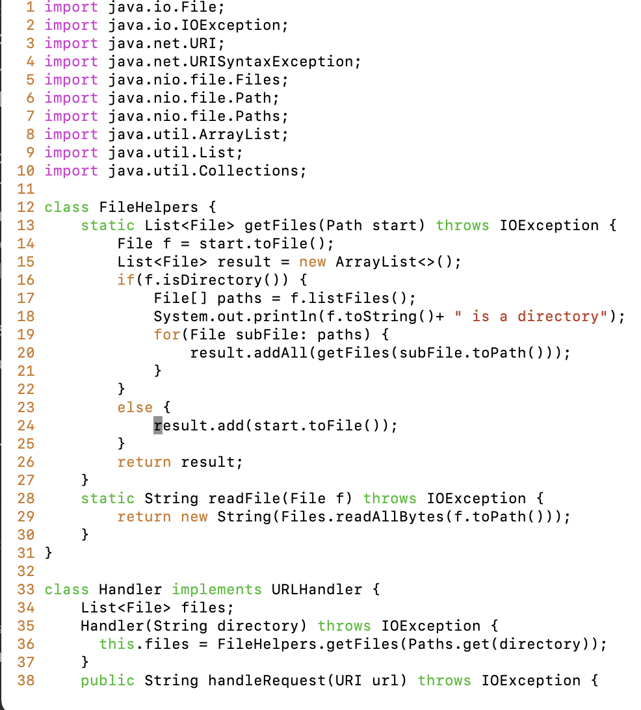
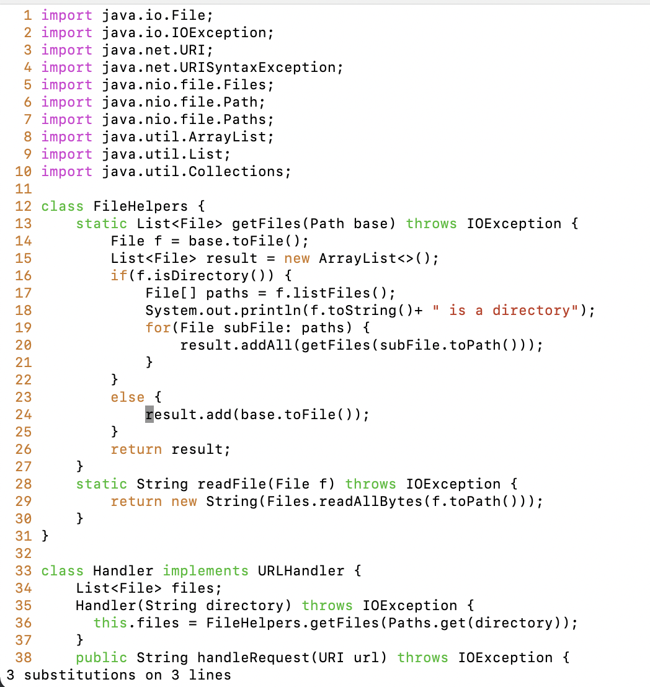

# Week 7 Lab Report

## Part 1: Changing the name of 'start' and its uses to 'base'

The commands I used is this one line command:

`:13,32 s/start/base/ <Enter>`

- The 13,32 denotes which lines the command will run
- the s represents substitute
- the first term is the one we want to replace, in this case `start`
-the second term is what we want to replace it with, in this case `base`

The result is:

## Part 2

Edit local and upload: 33 seconds

Edit on remote: 27 seconds

Editing locally, ive found that saving in vscode then going to my terminal and doing the scp command makes use of unnecessary time.

when I remote onto vim my biggest issue is that I have a habit of pressing enter or typos which ruins the formatting of the file and I have to delete the new line.

Q1: i would prefer using VIM since its a lightweight editor that I can use from anywhere, its especially useful if the changes are only small changes.

Q2: I think the scale of the changes would factor in my choices, for example if I was making a reactJS app, I prefer doing changes in vscode rather than vim at the start, then if I have to do minor edits I would use vim.